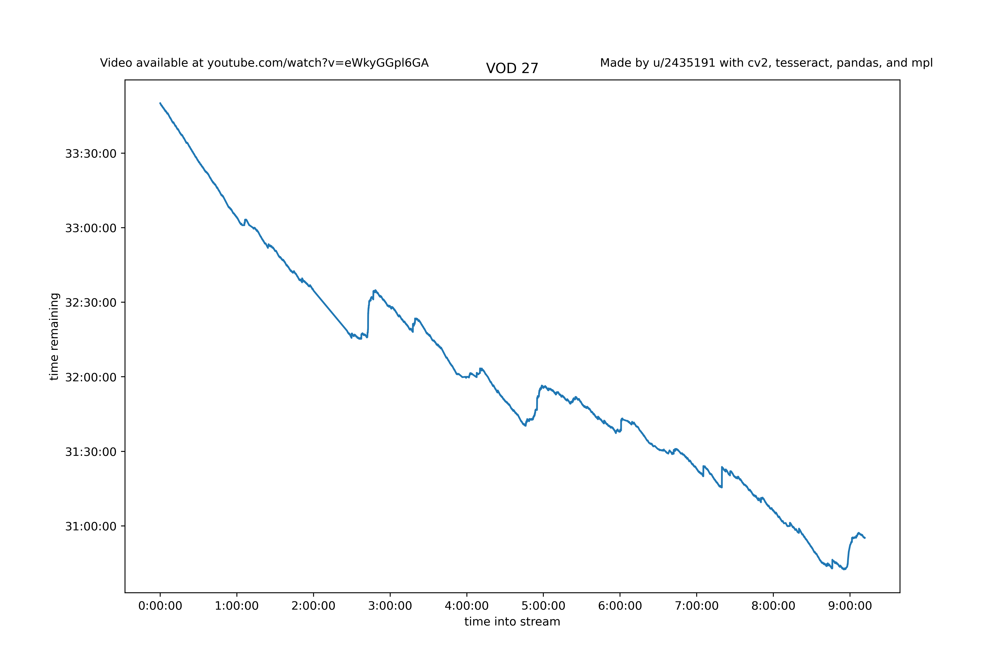

# Ludwig-Ahgren-Subathon-OCR

## Purpose
* Ludwig Ahgren, a popular streamer and YouTuber, livestreamed his entire life for around a month between March and April 2021.
* Every time a Twitch viewer donated, an onscreen timer would increase. If the timer ever decremented so far that it reached zero, the subathon would be over.
* This repo uses OpenCV and Tesseract OCR to scan the timer and record these timer values for anyone to use.
 

## Notes
* Samples are 1 / sec. Even with only 50% of successful OCR, this would be more than enough data.
* Depending on internet, this may take a while. My initial goal was to spend 1 sec real time per 10 seconds of footage processed. Right now it's about 1:8.
* See [data/csvs](data/csvs) and [data/graphs](data/graphs).

## TODO
* [x] Unscuff `"video_timestamp"` column
* [ ] Add proper `logging` support
* [ ] Make OCR more reliable— right now it is only 60-80%. Specifically, the program fails when the timer flashes red or there is too much noise around the timer
* [ ] ~~In a similar vein, make 240p (or even 144p) usable.~~
* [x] More threads/processes— the program is usually *not* bound by network IO
* [ ] Write more tests
* [ ] Add more data
* [ ] Write proper docstrings/type hints
* [ ] Add SQL DB support

## Known Issues
* ETA faulty when `start_frac != 0`
* Threads aren't synchronized— e.g. when `frac_done == 0.35`, one could be 34% done and another 36%. Smarter `frac_done` will fix this.
* Interrupting with ctrl-C usually causes the csv to delete
